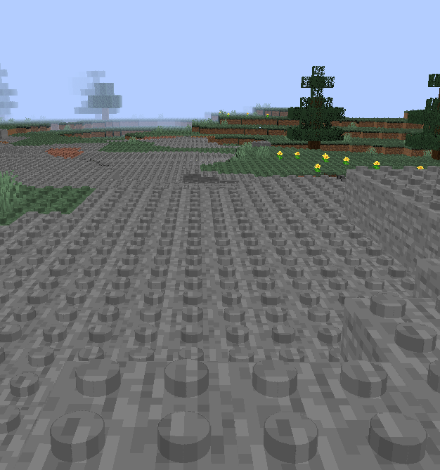
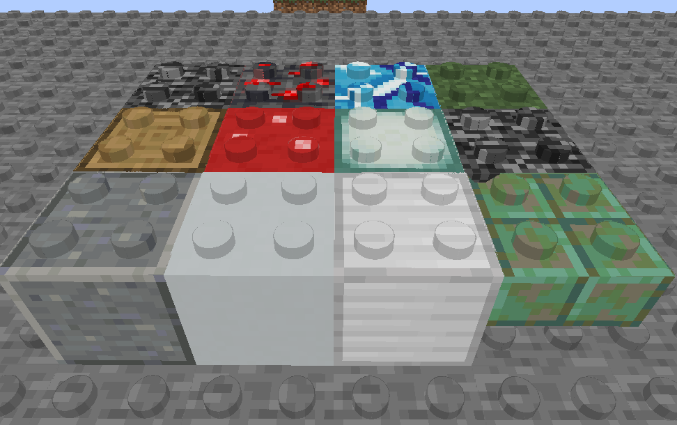

# Danish block shader

Creates small pegs on top of cuboid blocks

## Disclaimer

This is a proof of concept, it is not tested very thoroughly, so there might be some bugs.

The resourcepack doesn't use any custom models, so it's compatible with most other resourcepacks that don't use shaders.

## How to install

1. Press the green `Code` button and select `Download ZIP`
2. Extract the contents of the ZIP into your resourcepack folder
3. Start the game and enable the resource pack
   
## Examples

